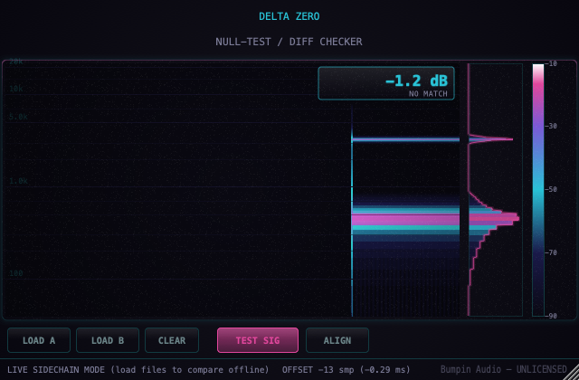

# Delta Zero

**A phase-cancellation null-test / difference-checker plugin.**

Feed two versions of the same audio (a re-render, a bounce after a plugin change,
an A/B of a master) into Delta Zero's main input and sidechain, hit **Align**, and it
finds the sample-accurate timing offset between them automatically via
cross-correlation, then outputs only the difference. If the two sources are
identical, the output is silence — a perfect null, reaching zero. Anything left
over is real, audible, and shown live on a scrolling spectrogram: exactly which
frequencies and moments the two sources actually differ at.

Built with [JUCE](https://juce.com/), ships as VST3 / AU / Standalone on macOS
and Windows.

<p align="center">
  
</p>

<p align="center">
  <strong><a href="https://github.com/nabsei/delta-zero/releases/latest">⬇ Download the latest beta</a></strong> — macOS and Windows, free during the beta period.
  · <a href="CHANGELOG.md">Changelog</a>
</p>

<p align="center">
  Also listed on <a href="https://www.kvraudio.com/product/delta-by-montagem">KVR Audio</a>.
</p>

## Why this exists

Null-testing is a standard technique (invert one signal, sum it with the
other, listen to what's left) but doing it properly requires the two sources
to be aligned to the sample — even a 1-sample offset destroys the null and
makes two identical signals look completely different. Delta Zero automates
that alignment step and gives you a live visual of the residual instead of
just a number, so you can actually see where two mixes/renders/masters
diverge, not just that they do.

This is aimed at a different audience than typical creative effects — audio
engineers doing verification/QA work — so it keeps its own instrument-panel
layout: monospace readout type, a frequency-axis spectrogram instead of a
knob. The colour language shares the Bumpin Audio catalogue's cyan/magenta
identity.

## Status

Early-stage / actively developed, free during the beta period. This
repository is the actual source used to build the shipped/tested plugin --
JUCE plugin wrapper with a sidechain input bus, cross-correlation alignment,
FFT-based spectrogram pipeline, custom UI, all included as-is (unlike the
Montagem/Yano one-knob lines, Delta Zero's algorithm is correctness-driven,
not a tunable "secret sauce", so there's nothing to redact).

## Features

- Sidechain-based dual input: main = source A, sidechain = source B,
  output = A − delay-compensated B
- One-click automatic sample-accurate alignment via cross-correlation
  (± ~5.8ms search window)
- Live scrolling spectrogram of the residual on a logarithmic frequency
  axis, with a peak-hold contour and a dB colour legend
- Built-in synthetic test signal (no real routing needed to try it out)
- Denormal-safe processing, lock-free audio-thread-to-UI handoff for the
  spectrogram data (no locks on the audio thread)
- Builds as **VST3**, **AU** (passes `auval` validation), and a
  **Standalone** app

## Tech stack

- C++17, [JUCE](https://github.com/juce-framework/JUCE) (audio processing + UI)
- CMake + Ninja

## Building

```bash
git clone --depth 1 https://github.com/juce-framework/JUCE.git libs/JUCE
cmake -B build -G Ninja -DCMAKE_BUILD_TYPE=Release
cmake --build build
```

On macOS, add `-DCMAKE_OSX_ARCHITECTURES="arm64;x86_64"` to the configure step
to build a universal binary (Apple Silicon + Intel) instead of the host-only
default. The official beta releases are built this way.

This produces a VST3, an AU component, and a standalone app under
`build/DeltaZero_artefacts/Release/`, and installs the plugin formats into your
system's plugin folders automatically (`COPY_PLUGIN_AFTER_BUILD`).

## Project structure

```
Source/
  PluginEntry.cpp       JUCE plugin entry point
  DeltaProcessor.*       AudioProcessor: sidechain bus, alignment, FFT pipeline
  PluginEditor.*          Custom UI (spectrogram, peak-hold, legend, HUD)
  DeltaLookAndFeel.h      Custom LookAndFeel (monospace, cyan/magenta controls)
CMakeLists.txt
```

## Open items

- [ ] Code signing / notarization for both macOS and Windows (current
      beta requires a one-time manual step on first install)
- [x] Resizable / high-DPI UI
- [x] Automated test suite (headless DSP + UI snapshot tools, private repo)
- [ ] Real-world testing in a DAW (Ableton, Logic, FL Studio, etc.) and on
      an actual Windows machine -- so far only Standalone-on-macOS and CI
      compile checks
- [ ] Licensing gate for the post-beta paid release

## License

**This repository's source code:** MIT — see [LICENSE](LICENSE). Covers
the full source used to build the shipped plugin (JUCE plugin wrapper,
sidechain bus setup, alignment algorithm, UI, build setup) -- as noted
above, there's no separately-withheld "tuned" version.

**The compiled plugin (downloads / releases):** free to use during the beta
period, not free to redistribute or resell. See the `TERMS.txt` included in
each release download for the full terms. A paid license will replace this
beta terms after the beta period ends.

## Also from Bumpin Audio

- [Delta Blind](https://github.com/nabsei/delta-blind) — loudness-matched A/B compare tool (the second piece of the Delta line, same audience)
- [Montagem 808](https://github.com/nabsei/montagem-808)
- [Montagem Finisher](https://github.com/nabsei/montagem-finisher)
- [Montagem Widener](https://github.com/nabsei/montagem-widener)
- [Montagem Punch](https://github.com/nabsei/montagem-punch)
- [Yano Log](https://github.com/nabsei/yano-log)
- [Yano Finish](https://github.com/nabsei/yano-finish)
- [Yano Space](https://github.com/nabsei/yano-space)
- [Yano Swing](https://github.com/nabsei/yano-swing)

Two families of one-knob plugins for funk automotivo/phonk (Montagem) and
amapiano (Yano) production, plus the Delta line of verification tools for
audio engineers.
